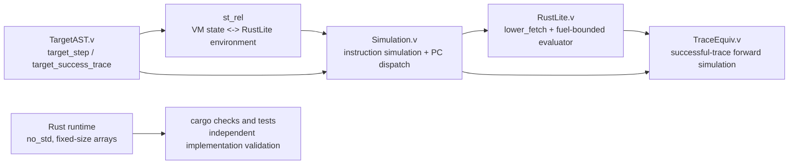

# MicroVeriVM

MicroVeriVM is a deterministic, bounded 32-bit stack virtual machine with a safe `no_std` Rust runtime and a machine-checked Rocq (Coq) semantics and forward-simulation proof.

It is intentionally small enough to inspect end to end: ten instructions, a 256-word stack, 1024 words of memory, explicit traps, numeric program-counter targets, and arithmetic defined modulo 2^32. The project is both a systems-engineering example and a practical teaching artifact for formal semantics and proof-assisted development.

> **Verification scope:** The Coq development proves a forward simulation from successful steps of the `TargetAST.v` machine into the RustLite execution model, and lifts it to successful traces without taking a per-step simulation theorem as a hypothesis. `coqchk` validates the compiled Coq proof objects. This is not a mechanized proof of the separately maintained Rust source code, nor a proof of full behavioral equivalence or bisimulation. The Rust implementation is built, linted, and tested independently.

## Highlights

- **Deterministic word semantics:** `ADD`, `SUB`, and program-counter advancement wrap modulo 2^32, matching `u32::wrapping_add` and `u32::wrapping_sub`.
- **Bounded state:** The runtime stack has 256 words and memory has 1024 words, both stored in fixed-size arrays.
- **Explicit failure behavior:** Stack underflow/overflow, invalid memory addresses, and invalid program counters return named errors.
- **Safe runtime:** The crate uses `#![no_std]` and `#![forbid(unsafe_code)]`; VM state does not use dynamic allocation.
- **Closed bridge proofs:** The project-level Coq sources contain no `Admitted`, `admit`, `Axiom`, or `Abort` placeholders. The main step- and trace-simulation theorems report “Closed under the global context.”
- **Kernel validation:** The Coq gate compiles 14 modules sequentially and checks them with `coqchk`.

## Architecture

The formal bridge has five layers:

1. **RustLite** (`coq/Bridge/RustLite.v`) defines a small statement language, environment, and fuel-bounded evaluator.
2. **Target machine** (`coq/TargetAST.v`) defines the ten target instructions and their step semantics over the Rust model.
3. **Representation relation** (`st_rel` in `coq/Bridge/Simulation.v`) relates the formal VM's PC, stack, memory, and status to the RustLite environment.
4. **Fetch and instruction simulation** (`coq/Bridge/Simulation.v`) proves instruction cases and connects indexed target fetch to the ordered RustLite fetch chain.
5. **Trace lifting** (`coq/Bridge/TraceEquiv.v`) lifts successful target traces to RustLite executions using the proved per-step simulation.



The verified trace result is a **forward simulation for traces whose target steps succeed**. It does not assert reverse simulation, failure-trace equivalence, or equivalence of every behavior of the Rust source. See [the architecture guide](docs/ARCHITECTURE.md) for proof boundaries and [the white paper](docs/WHITE-PAPER.md) for the formal model, proof methodology, and limitations.

## Instruction set

| Instruction | Behavior |
| --- | --- |
| `CONST(u32)` | Push a word and advance the PC. |
| `ADD` | Pop right then left, push `left.wrapping_add(right)`, advance the PC. |
| `SUB` | Pop right then left, push `left.wrapping_sub(right)`, advance the PC. |
| `DUP` | Duplicate the top word and advance the PC. |
| `DROP` | Pop the top word and advance the PC. |
| `LOAD(address)` | Load memory and push the word, then advance the PC. |
| `STORE(address)` | Pop a word and store it at the checked address, then advance the PC. |
| `JMP(target)` | Set the PC to a valid numeric target. |
| `JZ(target)` | Pop a condition; jump if zero, otherwise advance the PC. |
| `HALT` | Mark the state halted. |

Labels are not part of the runtime instruction language. An external assembler must resolve labels to numeric PC targets before the VM runs; that assembler pass is outside the formal scope of verification v1.

## Requirements

- **Rust:** stable Rust toolchain with Cargo. On Windows, use the `x86_64-pc-windows-msvc` target and a compatible Visual Studio Build Tools installation when required by the toolchain.
- **Rocq/Coq:** Rocq Platform 9.1 or compatible `coqc`/`coqchk` executables. Put the toolchain's `bin` directory on `PATH` for direct commands. The PowerShell gate also checks several common Windows install locations.
- **PowerShell:** Windows PowerShell for `scripts/check-coq.ps1`.
- **Windows test runtime:** If a Windows Rust test executable cannot start because an MSVC runtime DLL is unavailable, install the matching Visual C++ runtime or use the static CRT flag shown below.

## Set up a development environment

1. Install Visual Studio Build Tools with the **Desktop development with C++** workload when using the Windows MSVC Rust target.
2. Install Rust through rustup, then select the stable toolchain and MSVC target:

   ```powershell
   rustup toolchain install stable --profile minimal
   rustup default stable
   rustup target add x86_64-pc-windows-msvc
   rustc --version
   cargo --version
   ```

3. Install Rocq Platform 9.1 or a compatible Rocq distribution. Add its `bin` directory to the current user's `PATH`, then confirm both tools resolve:

   ```powershell
   coqc --version
   coqchk --version
   ```

4. Open PowerShell in the repository root. The commands below are written for that location. If Cargo's default test executable cannot start due to a missing MSVC runtime DLL, use the static CRT test invocation in the Rust section.

## Build, test, and verify

Run the commands from the repository root.

### Rust checks

```powershell
cargo fmt --all -- --check
cargo check --locked --all-targets
cargo build --locked --all-targets
cargo clippy --locked --all-targets -- -D warnings
```

Expected result: each command exits successfully; formatting emits no differences, and Clippy emits no warnings.

Run the Rust tests:

```powershell
cargo test --locked --all-targets
```

On Windows MSVC systems without the required dynamic runtime DLLs, statically link the CRT for this invocation:

```powershell
$env:RUSTFLAGS = "-C target-feature=+crt-static"
cargo test --locked --all-targets
Remove-Item Env:RUSTFLAGS
```

Expected result: unit and integration test executables run and report all tests passing. The static-link flag is a test-host workaround, not a project source or manifest setting.

### Coq compile and kernel gate

Run the authoritative sequential compilation and kernel-validation script:

```powershell
powershell -NoProfile -ExecutionPolicy Bypass -File .\scripts\check-coq.ps1
```

Expected final line:

```text
PASS: all fourteen files compiled sequentially; coqchk validated all fourteen modules
```

The gate writes detailed status and compiler logs under `coq/build-check/`. Its successful exit means each listed module compiled with no diagnostics, required extraction artifacts were present, and `coqchk` validated all 14 modules.

To invoke `coqchk` directly after the script has compiled the modules, ensure the Rocq `bin` directory is on `PATH` and run:

```powershell
coqchk -Q coq MicroVeriVM `
  MicroVeriVM.RustModel `
  MicroVeriVM.Invariants `
  MicroVeriVM.Correspondence `
  MicroVeriVM.Syntax `
  MicroVeriVM.Semantics `
  MicroVeriVM.Proofs `
  MicroVeriVM.Equivalence `
  MicroVeriVM.Soundness `
  MicroVeriVM.CanonicalAST `
  MicroVeriVM.TargetAST `
  MicroVeriVM.Bridge.RustLite `
  MicroVeriVM.Bridge.Simulation `
  MicroVeriVM.Bridge.TraceEquiv `
  MicroVeriVM.Extraction
```

Expected result includes `Modules were successfully checked`.

For example, inspect the assumptions of the principal bridge theorems in `coqtop`:

```coq
Require Import MicroVeriVM.Bridge.TraceEquiv.
Print Assumptions MicroVeriVM.Bridge.Simulation.target_step_simulation.
Print Assumptions MicroVeriVM.Bridge.TraceEquiv.run_sim_from_step_simulation.
```

Both report `Closed under the global context`.

## Repository map

```text
.
|-- Cargo.toml, Cargo.lock, Makefile
|-- README.md
|-- LICENSE-APACHE
|-- _CoqProject
|-- coq/
|   |-- RustModel.v, Invariants.v, Correspondence.v
|   |-- Syntax.v, Semantics.v, Proofs.v, Equivalence.v, Soundness.v
|   |-- CanonicalAST.v, TargetAST.v, Extraction.v
|   `-- Bridge/
|       |-- RustLite.v
|       |-- Simulation.v
|       `-- TraceEquiv.v
|-- rust/src/                 # Safe no_std implementation
|-- tests/                    # Rust integration tests
|-- scripts/                  # PowerShell validation gates
|-- docs/
|   |-- ARCHITECTURE.md
|   |-- WHITE-PAPER.md
|   `-- project and phase notes
`-- .github/workflows/        # CI workflows
```

## Contributing

Contributions should preserve the VM's bounded, deterministic semantics and keep implementation, formal model, and documentation aligned.

1. Keep runtime code safe: do not introduce `unsafe` or heap allocation into VM state.
2. Update the Coq semantics and bridge whenever instruction behavior changes. Close proofs with checked terms; do not add `Admitted`, `admit`, `Axiom`, or `Abort`.
3. Add or adjust Rust tests for success paths, traps, and relevant boundary values.
4. Run the Rust checks and the Coq gate above before opening a pull request.
5. Document any intentional scope boundary or behavior change.

## License

MicroVeriVM is distributed under the [Apache License, Version 2.0](LICENSE-APACHE).
