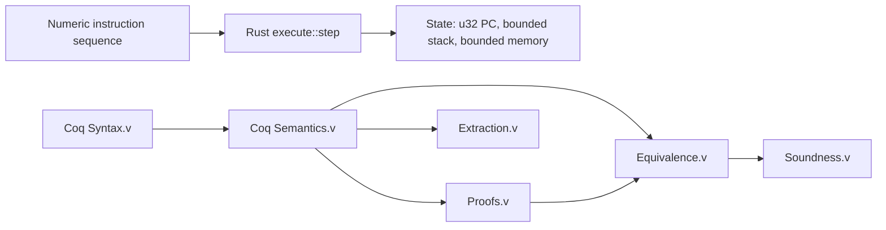

# MicroVeriVM

**A bounded 32-bit stack virtual machine with a Rust reference implementation and a Rocq (Coq) relational model.**

MicroVeriVM is a small, dependency-free systems project for studying how a compact virtual machine can be implemented in safe Rust and described in a theorem prover. Its instruction set uses 32-bit words, a fixed-capacity operand stack, fixed-size word-addressed memory, numeric program-counter targets, and explicit execution traps. The package exposes a reusable Rust library; it intentionally has no parser or command-line interface.

The executable Rust step function is deterministic. The Coq development specifies machine data and a relational small-step semantics, proves selected safety and boundary properties, and configures extraction of data and arithmetic definitions. The current development does **not** establish an independently mechanized refinement from the compiled Rust implementation to the Coq model; see [Formal assurance and scope](#formal-assurance-and-scope).

## At a glance

| Property | Current design |
| --- | --- |
| Word width | 32 bits (`u32` in Rust; bounded `N` subtype in Coq) |
| Arithmetic | ADD, SUB, and sequential PC advancement wrap modulo $2^{32}$ |
| Operand stack | Fixed capacity: 256 words |
| Memory | Fixed capacity: 1,024 words |
| Instruction set | `CONST`, `ADD`, `SUB`, `DUP`, `DROP`, `LOAD`, `STORE`, `JMP`, `JZ`, `HALT` |
| Rust constraints | `no_std`, `forbid(unsafe_code)`, no third-party dependencies |
| Formal model | Coq syntax, relational step semantics, proof lemmas, trace definitions, and extraction setup |
| License | Apache License 2.0 |

## Architecture



### Rust execution engine

The crate is organized around a single-step executor and small, fixed-capacity state components:

- `rust/src/instruction.rs` defines the ten instruction variants and their numeric operands.
- `rust/src/execute.rs` fetches the instruction at the current PC, performs one operation, checks targets and addresses, and updates the state.
- `rust/src/state.rs` stores the PC, stack, memory, and running/halted status.
- `rust/src/stack.rs` and `rust/src/memory.rs` implement bounded storage without heap allocation.
- `rust/src/error.rs` defines execution traps for stack overflow/underflow, out-of-bounds memory, invalid PC, and invalid instruction.

Integer-word arithmetic and sequential PC advancement use Rust's explicit wrapping operations. Thus addition and subtraction are evaluated modulo $2^{32}$; overflow does not panic. Stack and memory capacities remain independently checked. Jump targets are numeric `u32` addresses and must identify an instruction in the supplied program.

### Coq formal model

The formal development is split by responsibility:

| File | Role |
| --- | --- |
| `coq/RustModel.v` | Standalone mathematical model of Rust words, bounded stack, fixed memory, state, instructions, errors, and post-error results |
| `coq/Invariants.v` | Valid-state predicate and structural stack, memory, and PC representation preservation proofs |
| `coq/Syntax.v` | Bounded 32-bit words, instruction syntax, fixed-capacity state, and initial values |
| `coq/Semantics.v` | Relational single-step semantics, modular arithmetic, PC advancement, memory/stack operations, and traps |
| `coq/Proofs.v` | Stack and memory lemmas, progress witnesses, determinism results, and `u32::MAX` arithmetic/PC boundary proofs |
| `coq/Equivalence.v` | Stack and memory safety invariants for the legacy Coq semantics; it makes no cross-language simulation claim |
| `coq/Soundness.v` | Successful multi-step traces and Coq trace safety properties |
| `coq/Extraction.v` | OCaml extraction configuration for computational data and arithmetic |

Coq words are naturals paired with a proof that the value is less than $2^{32}$. Modular results are brought back into that bounded domain. The model's PC increment wraps just as Rust's does.

## Labels and control flow

The VM accepts numeric jump targets only. If a source language uses symbolic labels, an **external assembler pass resolves labels at compile time**, before VM execution, and emits numeric PC targets. The assembler is outside the v1 formal-verification boundary; the Coq step relation operates only on numeric targets.

## Formal assurance and scope

The current Coq sources compile in dependency order without diagnostics under the configured gate. The proof files contain no `Admitted`, `admit`, custom axioms, or aborted proofs. The development includes machine-checked boundary results for `u32::MAX + 1`, `0 - 1`, and advancing a PC at `u32::MAX`, as well as selected stack, memory, and transition properties.

`coq/RustModel.v` is intentionally independent of `coq/Syntax.v`. It defines Rust-shaped machine data and a failure result carrying the post-mutation state. No `rust_step_simulates_coq` theorem is currently claimed: the Rust-shaped model does not yet include an independent transition relation and representation proof connecting it to the Rust executor. The old identity-alias simulation claims have been removed rather than presented as cross-language verification.

Full behavioral equivalence requires a representation relation with suitable totality and injectivity properties, plus proof obligations connecting actual Rust transitions to Coq transitions in both directions. That end-to-end refinement is future work. Likewise, the Coq `step` relation is in `Prop` and is erased by standard extraction; the present extraction configuration does not generate an executable VM interpreter.

These distinctions are intentional release transparency: successful Coq compilation certifies the checked Coq proof terms, not an unproved cross-language correspondence claim.

## Prerequisites

- Rust stable toolchain and Cargo (Rust edition 2021).
- Rocq/Coq with `coqc` available on `PATH`. The project gate was validated using Rocq Platform 9.1; the repository does not currently pin a compiler version.
- Windows PowerShell for the supplied sequential gate script. On other operating systems, run the direct `coqc` commands below.
- On Windows using the `*-pc-windows-msvc` Rust target, the Microsoft Visual C++ Redistributable must be available at runtime.

Install Rust using [rustup](https://www.rust-lang.org/tools/install). Install Rocq using the [official installation guide](https://rocq-prover.org/install). Confirm the tools are available:

```sh
rustc --version
cargo --version
coqc --version
```

## Build and verification

Run commands from the repository root.

### Rust

```sh
cargo fmt --check
cargo check --locked --all-targets
cargo build --locked --all-targets
cargo test --locked
cargo clippy --locked --all-targets -- -D warnings
```

The integration suite is in `tests/end_to_end.rs`. It exercises all ten instructions, arithmetic wraparound, stack and memory traps, branching, invalid PCs, halt behavior, and arithmetic boundaries. A unit test also checks PC wraparound at `u32::MAX`.

### Coq / Rocq

On Windows PowerShell:

```powershell
powershell -NoProfile -ExecutionPolicy Bypass -File scripts/check-coq.ps1
```

The gate compiles `RustModel`, `Invariants`, `Syntax`, `Semantics`, `Proofs`, `Equivalence`, `Soundness`, and `Extraction` sequentially with default warnings enabled. It requires empty diagnostic logs and checks for the extracted `microverivm.ml` and `microverivm.mli` artifacts.

For a direct compiler run from the repository root:

```sh
coqc -q -w +default -Q coq MicroVeriVM coq/RustModel.v
coqc -q -w +default -Q coq MicroVeriVM coq/Invariants.v
coqc -q -w +default -Q coq MicroVeriVM coq/Syntax.v
coqc -q -w +default -Q coq MicroVeriVM coq/Semantics.v
coqc -q -w +default -Q coq MicroVeriVM coq/Proofs.v
coqc -q -w +default -Q coq MicroVeriVM coq/Equivalence.v
coqc -q -w +default -Q coq MicroVeriVM coq/Soundness.v
coqc -q -w +default -Q coq MicroVeriVM coq/Extraction.v
```

Run these in order because each module imports earlier modules. The direct commands use a logical library mapping of `MicroVeriVM` to the `coq` directory.

## CI/CD and testing

There is currently **no checked-in GitHub Actions workflow**. The commands above are the recommended CI gates for pull requests and release builds. A GitHub Actions configuration should install stable Rust and the supported Rocq toolchain, then run the Rust checks/tests and the sequential Coq gate; CI should treat compiler diagnostics as failures and preserve the Coq gate status and logs as build artifacts.

The Rust test suite and Coq proof compilation are separate gates: `cargo test` validates executable behavior, while the Coq gate checks the formal sources. Neither gate alone establishes the independent Rust-to-Coq refinement described above.

## License

MicroVeriVM is distributed under the [Apache License, Version 2.0](LICENSE-APACHE).
