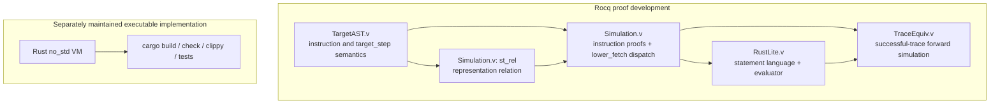

# MicroVeriVM Architecture

This guide describes MicroVeriVM as a bounded virtual machine and as a formal-methods case study. It follows the path from the target instruction semantics to the RustLite evaluator and explains exactly what the current proofs establish.

> **Migration note:** `coq/RiscV/` contains a separate RV32I model with architectural foundations, a named-subset AST and decoder, operational semantics, memory safety, multi-step execution, binary-image application integration, trap handling, privileged-state and interrupt models, retirement/event traces, application execution, and top-level invariants. `BisimulationRefinement.v` proves successful-trace correspondence between the legacy Rust-shaped stack model and its separate Rocq stack semantics; it does not relate RV32I execution to the stack VM or prove the Rust source. The application boundary consumes word-sized text/data segments supplied by an external loader; ELF parsing and byte-level loading remain outside the formal model. Detailed guides are available for [Phases 1–7](rv32i-phase1.md).

## At a glance

MicroVeriVM consists of a separate safe Rust implementation and a Rocq formal development. Its core machine has 32-bit words, a 256-word stack, 1024 words of fixed memory, a numeric program counter, and a running/halted status. Both arithmetic and ordinary PC advancement wrap modulo 2^32. Stack and memory bounds are explicit; invalid operations produce named errors in Rust and corresponding outcomes in the formal model.

The formal bridge is arranged in five layers:



The Coq proofs relate formal definitions to formal definitions. Rust's `cargo` gates validate the separately maintained Rust implementation; they are not a mechanized proof that compiled Rust source refines the Coq development.

## 1. Verification philosophy and trust boundary

Testing samples executions. It is essential for implementation feedback, but a finite test suite alone cannot establish a property for every representable input and state. An interactive theorem prover can express such universal claims as propositions and check proof terms against a small trusted kernel.

Rocq (historically Coq) supports this style of development:

1. Define types for words, machine state, instructions, and outcomes.
2. Define execution as total functions and relations over those types.
3. State properties such as instruction correctness, state preservation, and simulation.
4. Construct proofs from definitions and previously checked lemmas.
5. Compile the modules and have `coqchk` validate their proof objects and dependencies.

The project follows a zero-placeholder discipline: no project Coq source should contain `Admitted`, `admit`, `Axiom`, or `Abort`. The principal step and trace simulation theorems are closed under the global context. This means those theorems introduce no additional assumptions beyond the imported definitions and logic.

### What this does and does not guarantee

The target-to-RustLite result is an **unconditional forward simulation theorem for successful target traces**: after the target trace and initial state relation are supplied, no separate per-step simulation theorem is assumed. Separately, the Rust-shaped Coq model has bidirectional successful-trace correspondence with its Rocq semantics. Neither theorem proves:

- full behavioral equivalence between the executable Rust source and a Coq model;
- reverse simulation or equivalence of failure traces for the target-to-RustLite bridge;
- refinement between the separate RV32I machine and the legacy stack VM;
- that the separately compiled Rust source is mechanically refined by the Coq model;
- correctness of a future assembler, compiler, or external system.

The Rust runtime is independently constrained (`no_std`, `forbid(unsafe_code)`, fixed-size state), checked by the Rust toolchain, and covered by unit and integration tests. The proof boundary must not be confused with those implementation checks.

## 2. Machine state and instruction semantics

### State layout

The Rust state in `rust/src/state.rs` contains:

| Component | Representation | Bound or interpretation |
| --- | --- | --- |
| Program counter | `u32` | Numeric instruction index; increment wraps modulo 2^32. |
| Operand stack | `[u32; 256]` plus depth | Active words are in bottom-to-top order. |
| Memory | `[u32; 1024]` | Fixed-size, word-addressed storage. |
| Status | `Running` or `Halted` | A halted step is a no-op success. |

There is no runtime symbolic-label lookup. An external assembler must resolve labels before execution and encode numeric PC targets; assembler behavior is outside the formal scope of verification v1.

### Word arithmetic

Let `M = 2^32`. A machine word is a natural number in `[0, M)`. Addition and subtraction are:

```text
add32(x, y) = (x + y) mod M
sub32(x, y) = (x + M - y) mod M
```

Rust uses `u32::wrapping_add` and `u32::wrapping_sub`. The Coq model constructs bounded words with the corresponding modulo operation. For example, `u32::MAX + 1` yields zero, and `0 - 1` yields `u32::MAX`.

### Instruction set

The Rust `Instruction` type and Coq `TargetInstruction` type each represent ten instructions:

| Instruction | State transition |
| --- | --- |
| `CONST(w)` | Push `w`; advance PC. |
| `ADD` | Pop right, pop left, push `add32(left, right)`; advance PC. |
| `SUB` | Pop right, pop left, push `sub32(left, right)`; advance PC. |
| `DUP` | Read top word, push a copy; advance PC. |
| `DROP` | Pop top word; advance PC. |
| `LOAD(a)` | Validate/read memory at `a`, push the word; advance PC. |
| `STORE(a)` | Validate `a`, pop a word, store it; advance PC. |
| `JMP(t)` | Validate `t` as an instruction index and set PC to `t`. |
| `JZ(t)` | Pop condition; if zero validate and jump to `t`, otherwise advance PC. |
| `HALT` | Set status to halted; leave PC, stack, and memory unchanged. |

The ordering of checks and state changes is observable. For example, `STORE` validates the address before popping, whereas `JZ` pops its condition before validating a zero-branch target. Rust tests exercise these partial-state cases.

## 3. The five formal layers

### Layer 1: RustLite core execution

`coq/Bridge/RustLite.v` defines:

- a small runtime value type and an environment represented by bindings;
- expressions for wrapped arithmetic, comparisons, vector access, and updates;
- statements for sequencing, conditionals, stack operations, traps, and other control;
- a fuel-bounded evaluator `exec`.

This is a Coq interpreter for the RustLite statement language. It is not the Rust compiler or a formal semantics of all Rust.

### Layer 2: Target virtual machine definitions

`coq/TargetAST.v` defines the ten `TargetInstruction` constructors, helper transitions, instruction evaluation (`target_eval`), and program stepping (`target_step`). Program dispatch selects an instruction with `nth_error` at the natural-number PC. Invalid fetches yield the target invalid-PC failure.

The target model uses the bounded word and state definitions in `coq/RustModel.v`. Its instruction cases make overflow, stack capacity, address validation, branch behavior, and halt state explicit.

### Layer 3: State relation (`st_rel`)

`st_rel` in `coq/Bridge/Simulation.v` relates a `RustState` to a RustLite environment by matching four named bindings:

```text
pc      <-> encoded current PC
stack   <-> encoded active stack words
memory  <-> encoded fixed memory contents
halted  <-> status flag
```

The relation deliberately describes the state that the simulation proof observes. It is not asserted to be a total, injective encoding over arbitrary environments. Lemmas such as `lookup_update_other` and the specialized `st_rel_update_*` lemmas establish that updating one field preserves unrelated fields.

### Layer 4: Instruction simulation and fetch dispatch

`coq/Bridge/Simulation.v` proves instruction-level simulation cases for arithmetic, stack, memory, jumps, and halt. It also proves the fetch correspondence:

1. `target_step` fetches instruction `i` using `nth_error program i`.
2. `lower_fetch` is an ordered RustLite conditional chain comparing the environment's PC against numeric instruction indices.
3. `lower_fetch_guard_from_st_rel` derives the dispatch guard from the state relation and PC.
4. `lower_fetch_dispatch_at_index` proves that the chain selects the same instruction body as the indexed fetch.
5. `target_step_simulation` combines the instruction proof, state relation, and dispatch bridge.

The per-step theorem is unconditional with respect to a separate simulation premise: it accepts a related state and a successful `target_step` equation, then constructs the RustLite execution and related next state.

### Layer 5: Trace forward simulation

`coq/Bridge/TraceEquiv.v` defines `lower_success_trace` and `run_sim_from_step_simulation`. The latter inducts over the target's successful trace, applying `target_step_simulation` at each step to build a corresponding RustLite trace.

This is a forward-lifting result for **successful** target transitions. Despite the module name `TraceEquiv.v`, the theorem is not full two-way trace equivalence: no reverse direction or failure-trace correspondence is claimed.

## 4. Rust runtime and safety constraints

The Rust crate starts with:

```rust
#![no_std]
#![forbid(unsafe_code)]
```

Stack and memory are fixed-size arrays; operations validate bounds and return the `Error` variants in `rust/src/error.rs`. The VM runtime does not allocate dynamic heap state. Unit tests may use the Rust test harness and standard testing infrastructure; the `no_std` claim applies to the library runtime.

The single-step entry point is `rust/src/execute.rs::step`. It fetches by numeric PC, applies instruction semantics, and returns a `Result`. The `wrapping_add` and `wrapping_sub` operations in the Rust executor align with the intended word arithmetic in the formal model.

The repository validates the Rust implementation with `cargo fmt`, `cargo check`, `cargo clippy`, and tests. These gates complement the Coq proof but do not themselves establish a formal Rust-to-Coq refinement theorem.

## 5. Build and verification pipeline

### Rust

From the repository root:

```powershell
cargo fmt --all -- --check
cargo check --locked --all-targets
cargo build --locked --all-targets
cargo clippy --locked --all-targets -- -D warnings
cargo test --locked --all-targets
```

On Windows MSVC machines that lack the dynamic CRT needed to start a test executable, statically link it for the test run:

```powershell
$env:RUSTFLAGS = "-C target-feature=+crt-static"
cargo test --locked --all-targets
Remove-Item Env:RUSTFLAGS
```

### Rocq compilation and `coqchk`

Install Rocq Platform 9.1 or compatible tools, add the Rocq `bin` directory to `PATH`, then run:

```powershell
powershell -NoProfile -ExecutionPolicy Bypass -File .\scripts\check-coq.ps1
```

The script compiles all 30 configured modules sequentially under the `MicroVeriVM` logical prefix, rejects proof-placeholder tokens, checks compiler diagnostics and extracted artifacts, and runs `coqchk` over the module list. Its expected success message is:

```text
PASS: all thirty files compiled sequentially; coqchk validated all thirty modules
```

Compilation logs and the status record are stored in `coq/build-check/`.

For a direct kernel-check invocation after successful compilation:

```powershell
coqchk -Q coq MicroVeriVM `
  MicroVeriVM.RustModel `
  MicroVeriVM.RiscV.Word `
  MicroVeriVM.RiscV.RegisterFile `
  MicroVeriVM.RiscV.Machine `
  MicroVeriVM.RiscV.Instruction `
  MicroVeriVM.RiscV.Decoder `
  MicroVeriVM.RiscV.Semantics `
  MicroVeriVM.RiscV.MemorySafety `
  MicroVeriVM.RiscV.Execution `
  MicroVeriVM.Invariants `
  MicroVeriVM.Correspondence `
  MicroVeriVM.Syntax `
  MicroVeriVM.Semantics `
  MicroVeriVM.Proofs `
  MicroVeriVM.Equivalence `
  MicroVeriVM.Soundness `
  MicroVeriVM.CanonicalAST `
  MicroVeriVM.TargetAST `
  MicroVeriVM.Bridge.RustLite `
  MicroVeriVM.Bridge.Simulation `
  MicroVeriVM.Bridge.TraceEquiv `
  MicroVeriVM.Extraction
```

The checker should report `Modules were successfully checked`. To inspect assumptions for the core bridge results, load `MicroVeriVM.Bridge.TraceEquiv` in `coqtop` and issue:

```coq
Print Assumptions MicroVeriVM.Bridge.Simulation.target_step_simulation.
Print Assumptions MicroVeriVM.Bridge.TraceEquiv.run_sim_from_step_simulation.
```

Both theorems should report `Closed under the global context`.

## 6. Repository map

```text
.
|-- Cargo.toml / Cargo.lock     Rust package and locked dependencies
|-- README.md                   Project overview and quick start
|-- LICENSE-APACHE              Apache License, Version 2.0
|-- _CoqProject                 Coq logical project configuration
|-- rust/src/                   no_std Rust library runtime
|-- tests/                      Rust integration tests
|-- coq/
|   |-- RiscV/                  RV32I foundations, decoder, semantics, and traces
|   |   |-- Word.v              32-bit words and modular arithmetic
|   |   |-- RegisterFile.v      x0 plus 31 writable registers
|   |   |-- Machine.v           aligned PC and RV32I state
|   |   |-- Instruction.v       typed named-subset instruction AST
|   |   |-- Decoder.v           bit extraction, decoder, and proofs
|   |   |-- Semantics.v         RV32I operational semantics
|   |   |-- MemorySafety.v      bounds, non-interference, and safety proofs
|   |   |-- Execution.v         finite multi-step execution and trace proofs
|   |   |-- TrapHandling.v      exception classification, redirection, and trace proofs
|   |   `-- SystemIntegration.v binary image start, bounded run, and safety proofs
|   |-- RustModel.v             legacy stack VM words and state
|   |-- Syntax.v / Semantics.v  foundational source language
|   |-- Proofs.v / Soundness.v  model lemmas and soundness results
|   |-- CanonicalAST.v          canonical instruction representation
|   |-- TargetAST.v             legacy target VM semantics
|   |-- Extraction.v            extraction entry point
|   `-- Bridge/
|       |-- RustLite.v          RustLite values, statements, and evaluator
|       |-- Simulation.v        legacy representation and per-step simulation
|       `-- TraceEquiv.v        successful-trace forward simulation
|-- scripts/                    PowerShell gates
|-- docs/                       architecture and project notes
`-- .github/workflows/          continuous-integration workflows
```

## 7. Contribution discipline

When changing the instruction set, state representation, or error behavior:

1. Update the Rust and formal definitions together.
2. Preserve explicit wrapping, bounds, and failure-order semantics.
3. Add Rust tests for the changed behavior and boundary cases.
4. Add or revise closed Coq proofs; do not use `Admitted`, `admit`, `Axiom`, or `Abort` as placeholders.
5. Run the Rust checks and the complete Coq gate.
6. Keep documentation clear about the scope of any newly claimed theorem.

## 8. License

The project is provided under the [Apache License, Version 2.0](../LICENSE-APACHE).
