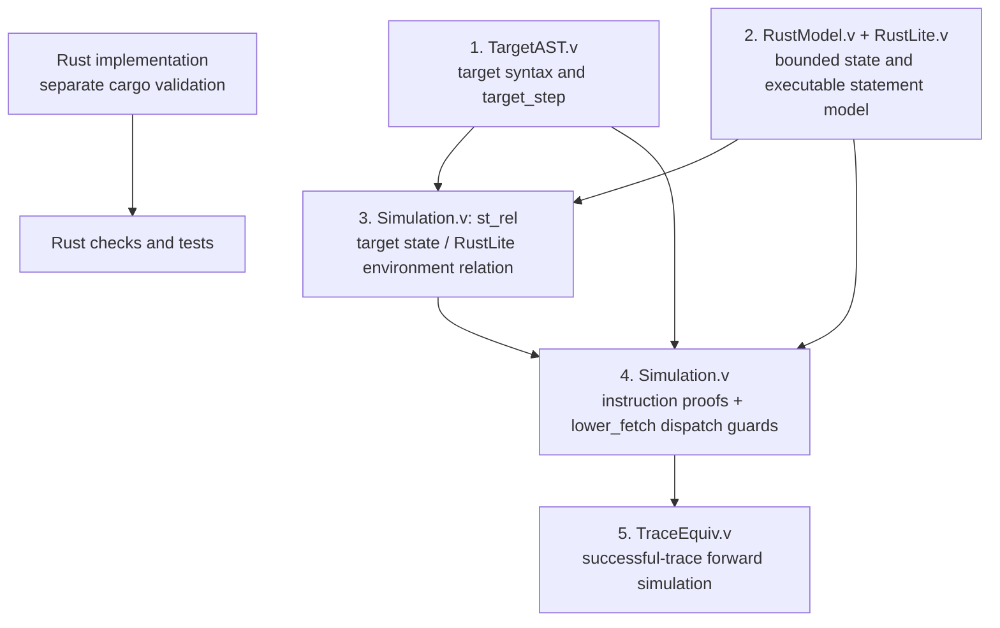

# A Small-Step Forward-Simulation Proof for a Bounded 32-Bit Stack Virtual Machine

## Abstract

MicroVeriVM contains a bounded, deterministic stack virtual machine implemented in safe `no_std` Rust, a Coq formal model of that stack machine, and a separate RV32I formalization. The legacy stack-machine proof development defines a ten-instruction target machine, a RustLite statement language, a representation relation between target states and RustLite environments, and proofs connecting instruction fetch and execution. Its principal result is forward simulation for successful target steps and traces. A separate Rust-shaped Coq model has step- and successful-trace correspondence in both directions with its Rocq semantics. The RV32I development defines a named instruction subset, operational semantics, safety invariants, trap and interrupt layers, trace tracking, and application-level composition. The compiled Coq modules are checked by `coqchk`.

These results are deliberately narrower than end-to-end verification of compiled Rust. The proofs relate formal Coq definitions; the Rust crate is separately checked, linted, and tested, but no mechanized theorem connects Rust source or machine code to either Coq machine. The target-to-RustLite trace result is forward-only and covers successful traces. The Rust-shaped model correspondence is bidirectional for its successful step/results and traces, but it is not an RV32I-to-stack-VM refinement or a proof of failure-trace equivalence for the target/RustLite bridge. This paper presents the model, proof architecture, engineering constraints, validation evidence, and these boundaries; it does not claim elimination of discrepancies outside the formal statements.

**Keywords:** operational semantics, forward simulation, Rocq, Coq, virtual machine, bounded execution, Rust, proof kernel

## 1. Introduction

Virtual machines routinely sit at a consequential boundary: they interpret compact instruction streams while updating stacks, memory, and control state. Errors in arithmetic, bounds checks, instruction fetch, or branch behavior can violate assumptions made by every program above them. Traditional testing is valuable, but finite tests cannot alone establish a universal property over all machine states and instruction sequences. Formal semantics and machine-checked proofs offer a complementary approach: define the machine mathematically, state the desired correspondence, and have a trusted proof kernel check a proof term.

MicroVeriVM explores this approach at deliberately modest scale. Its legacy stack VM has ten instructions, 32-bit words, a stack bounded to 256 words, and fixed memory of 1024 words. Its control flow uses numeric program-counter (PC) targets. Addition, subtraction, and ordinary PC advancement have modulo-2^32 behavior. Stack and memory accesses are bounded, and failures are represented explicitly. A separate RV32I model defines 32-bit words, the x0-safe register file, aligned-PC machine state, a typed decoder for a named base-instruction subset, and a small-step execution function with bounded word memory. It remains separate from the stack-VM proofs.

The work is motivated by high-assurance systems such as seL4, where formal verification has been applied to an operating-system kernel and its refinement relationships [1]. The comparison is one of method, not of scope or assurance level. seL4 addresses a vastly larger software artifact and establishes refinement properties between layers of a kernel implementation. MicroVeriVM instead isolates a small machine and proves a forward-simulation result between two formal Coq models. Its separate Rust implementation is subject to compiler checks and tests, but is not presently included in the mechanized refinement chain.

This paper makes four claims:

1. **An explicit bounded target semantics.** MicroVeriVM defines the instruction set and relevant boundary behavior over typed machine state.
2. **Compositional formal correspondence.** Instruction-level lemmas, state-update properties, and a PC fetch-dispatch theorem compose into a successful-step forward simulation from the target VM to RustLite. Separately, a Rust-shaped state/program relation supports model-level step and successful-trace correspondence in both directions.
3. **RV32I invariant composition.** The RV32I application layer composes ordinary, trap-aware, and PC-event-tracked bounded executions, with separate safety and trace theorems.
4. **Kernel-checked proof objects.** The project gate compiles 30 configured Coq modules and invokes `coqchk`.

We also make explicit what is not claimed: no assembler verification, no theorem about compiled Rust, no reverse simulation or failure-trace equivalence for the target-to-RustLite bridge, and no refinement between the RV32I model and the stack VM.

## 2. Machine model

### 2.1 State and words

Let the word modulus be \(M = 2^{32}\). A machine word is a natural number \(x\) such that \(0 \le x < M\). Define:

\[
\operatorname{add}_{32}(x,y) = (x+y) \bmod M
\]
\[
\operatorname{sub}_{32}(x,y) = (x+M-y) \bmod M.
\]

The target state contains a word-valued PC, a bounded stack, fixed-size memory, and a status in \(\{\mathsf{Running},\mathsf{Halted}\}\). The stack is represented as a list together with a proof that its length does not exceed 256. Memory is a vector of 1024 words, so valid memory addresses are precisely those below 1024. The formal definitions appear in [`RustModel.v`](../coq/RustModel.v).

The Rust implementation in [`state.rs`](../rust/src/state.rs), [`stack.rs`](../rust/src/stack.rs), and [`memory.rs`](../rust/src/memory.rs) uses fixed-size arrays and a stack-depth counter. The conceptual state is similar, but this paper does not treat that structural similarity as a proved representation theorem between Rust code and Coq.

### 2.2 Instruction set and ordering

The target language in [`TargetAST.v`](../coq/TargetAST.v) and the Rust enum in [`instruction.rs`](../rust/src/instruction.rs) each define ten instructions:

| Instruction | Successful behavior |
| --- | --- |
| `CONST(w)` | Push `w`; advance the PC. |
| `ADD` | Pop right then left; push \(\operatorname{add}_{32}(left,right)\); advance. |
| `SUB` | Pop right then left; push \(\operatorname{sub}_{32}(left,right)\); advance. |
| `DUP` | Push a copy of the top word; advance. |
| `DROP` | Pop the top word; advance. |
| `LOAD(a)` | Read memory at `a`; push the result; advance. |
| `STORE(a)` | Validate `a`, pop a word, store it; advance. |
| `JMP(t)` | Validate `t` as an in-range instruction index and set the PC. |
| `JZ(t)` | Pop a condition; if zero validate and jump, otherwise advance. |
| `HALT` | Set status to halted without changing the other state fields. |

The order of checks and mutations is part of the behavior. For instance, `STORE` checks the address before popping; `JZ` pops before checking the target on its zero branch. Arithmetic overflow is not a trap: the result is defined by modulo arithmetic. Rust uses `u32::wrapping_add` and `u32::wrapping_sub`, matching the intended word-level definitions.

Instruction targets are numeric PCs only. Symbolic labels must be resolved by an external assembler before execution; that assembler and its correctness are out of scope for verification v1.

## 3. Five-layer refinement stack

The formal development is organized as five interacting layers. The ordering below follows the proof dependencies rather than asserting a direct refinement theorem to the Rust implementation.



### 3.1 Layer 1: Target syntax and semantics (`TargetAST.v`)

`TargetAST.v` defines `TargetInstruction`, a family of state-transforming operations, `target_eval`, and `target_step`. A program is a list of instructions. When the machine is running, `target_step` obtains the instruction at index `N.to_nat (rust_pc state)` through `nth_error`; an absent entry produces an invalid-PC failure. A halted machine steps successfully to itself.

The evaluator distinguishes successful results from failures and preserves effects that occur before a failure where the instruction semantics specifies them. The successful trace relation is built from successful `target_step` transitions; it is not a relation over all failure outcomes.

### 3.2 Layer 2: Bounded model and RustLite evaluator

[`RustModel.v`](../coq/RustModel.v) supplies the typed word, stack, memory, state, and result definitions used by the target semantics. [`RustLite.v`](../coq/Bridge/RustLite.v) defines a compact statement language, expression evaluator, environment operations, and fuel-indexed execution function `exec`.

The RustLite model is designed to express the relevant implementation pattern—checks, stack updates, memory updates, PC updates, branches, and traps—in a language small enough to reason about structurally. It is a formal interpreter inside Coq, not a formal semantics for arbitrary Rust and not compiled output from the Rust crate.

### 3.3 Layer 3: State representation relation (`st_rel`)

The relation `st_rel state env` in [`Simulation.v`](../coq/Bridge/Simulation.v) requires the RustLite environment to contain values corresponding to four observable target-state components:

\[
\begin{aligned}
\mathsf{lookup}("pc",env) &= \mathsf{encode}(pc(state)),\\
\mathsf{lookup}("stack",env) &= \mathsf{encode}(stack(state)),\\
\mathsf{lookup}("memory",env) &= \mathsf{encode}(memory(state)),\\
\mathsf{lookup}("halted",env) &= \mathsf{encode}(status(state)).
\end{aligned}
\]

This is a relation used to establish forward preservation. It should not be described as a bidirectional invariant: the proof does not establish that every arbitrary RustLite environment represents a target state, nor that the representation is total and injective over all environments. Update lemmas such as `lookup_update_other` ensure that changing one named environment component preserves lookups of distinct components.

### 3.4 Layer 4: Instruction and fetch-dispatch proofs (`Simulation.v`)

There are two obligations in connecting a target program step to a RustLite program execution:

1. **Instruction correspondence.** For a selected instruction and related initial state, the target instruction result is related to the result of executing its lowered RustLite statement. The proof handles arithmetic, stack, memory, branch, and halt cases, including relevant capacity and validity branches.
2. **Fetch correspondence.** The target fetch uses `nth_error`; the lowered execution uses `lower_fetch`, an ordered chain of PC comparisons. The lemmas `lower_fetch_guard_from_st_rel` and `lower_fetch_dispatch_at_index` show that a related PC satisfies the guards needed for the chain to select the instruction at that index.

The composition lemma `lower_program_step_from_instruction_simulation` joins these facts. The principal result `target_step_simulation` has the following shape:

\[
\forall p,s,e,s'.\
  st\_rel(s,e) \land target\_step(p,s)=Success(s')
  \Rightarrow
  \exists f,e'.\
    exec(f,lower\_target\_program\_step(p),e)=ROk(e',CNormal)
    \land st\_rel(s',e').
\]

The theorem is unconditional in the important sense that it does not accept the general step-simulation theorem as a hypothesis: it derives the simulation from the instruction analyses and dispatch lemmas already proved in the development. Its logical premises still matter: the starting states must satisfy `st_rel`, and the target step must succeed.

### 3.5 Layer 5: Successful-trace forward simulation (`TraceEquiv.v`)

[`TraceEquiv.v`](../coq/Bridge/TraceEquiv.v) defines `lower_success_trace` and proves `run_sim_from_step_simulation`. The proof is induction on `target_success_trace`:

- In the reflexive case, preserve the supplied initial relation.
- In a step case, apply `target_step_simulation` to obtain a RustLite execution and a relation for the next states.
- Apply the induction hypothesis to the remaining target trace.
- Construct the corresponding lower trace.

Thus, given a successful target trace and a related starting environment, a related RustLite trace exists. This is a forward simulation and trace lifting theorem. It is not full trace equivalence: no converse theorem is established, and the trace relation does not encode target failures.

## 4. Proof methodology and kernel validation

### 4.1 Compositional proof structure

The proof is organized to keep instruction reasoning separate from program dispatch and trace induction. Local lemmas establish environment-update isolation and expression evaluations. Instruction-specific theorems then reason about concrete branches:

- `ADD` and `SUB`: first and second pop boundaries, successful wrapped computation, push, and PC advance;
- `LOAD`: valid address with available stack capacity, invalid address, and stack-capacity failure;
- `STORE`: address validity, underflow, and successful memory update;
- `JZ`: underflow, zero-target validation and jump, and nonzero fall-through;
- `DUP`: empty stack, available capacity, and full-stack overflow;
- other instructions: `CONST`, `DROP`, `JMP`, and `HALT`.

These cases compose through `target_eval_running_simulation` into a simulation result for each running instruction. The program-level theorem additionally handles PC fetch and the halted-state no-op branch.

### 4.2 Zero-placeholder policy and assumptions

The project maintains a zero-placeholder policy for Coq source: theorem proofs should not be left with `Admitted`, `admit`, `Axiom`, or `Abort`. The presence of a closed proof is not established merely by searching for those words; compilation and kernel checking are also required.

`Print Assumptions` on `target_step_simulation` and `run_sim_from_step_simulation` reports **“Closed under the global context.”** This means no extra proposition is required to use those theorem constants in the current Coq development. It does not, by itself, prove a statement about the Rust source or remove the need to specify the theorem's premises accurately.

### 4.3 `coqc` and `coqchk`

The project gate [`check-coq.ps1`](../scripts/check-coq.ps1) scans the Coq sources for forbidden proof-placeholder tokens, compiles 30 configured modules in dependency order, checks for compiler diagnostics and required extraction artifacts, and invokes `coqchk` on the resulting module list. A successful run confirms that these compiled proof terms and dependencies were accepted by the installed Coq kernel checker.

This is a strong and reproducible check of the formal development. It is not an independent proof of the Rust compiler, hardware, operating system, assembler, or the correspondence between the Rust source and the formal machine. Those remain outside the trusted formal chain presented here.

## 5. Execution engine and practical implementation

The Rust library under [`rust/src/`](../rust/src/) is `no_std` and starts with `#![forbid(unsafe_code)]`. VM stack and memory are fixed-size arrays. The state has a 32-bit PC, and instruction execution is implemented in `execute.rs::step`. Named error values represent stack underflow, stack overflow, invalid memory access, and invalid PC.

This design supports a constrained execution model:

- no dynamic allocation is required for VM stack or memory;
- stack and memory bounds are checked explicitly;
- arithmetic and sequential PC advancement use wrapping operations;
- jump targets are validated against the program length;
- halted states do not execute further instructions.

`cargo fmt`, `cargo check`, `cargo clippy`, and Rust unit/integration tests validate source formatting, type checking, lint cleanliness, and selected execution behavior. Tests include arithmetic boundaries, all ten instructions, trap conditions, and partial-state observations on selected failing instructions.

On Windows, a Rust test executable may depend on an MSVC runtime DLL. Passing `-C target-feature=+crt-static` through `RUSTFLAGS` can make the test executable link the CRT statically. This is a host/toolchain linking option for running tests; it is not the VM's memory manager, does not change the VM's fixed-size memory model, and is not part of the Coq proof.

## 6. Validation protocol

From the repository root, the Rust checks are:

```powershell
cargo fmt --all -- --check
cargo check --locked --all-targets
cargo clippy --locked --all-targets -- -D warnings
cargo test --locked --all-targets
```

The authoritative formal gate is:

```powershell
powershell -NoProfile -ExecutionPolicy Bypass -File .\scripts\check-coq.ps1
```

The gate reports success only after all 30 configured modules compile and `coqchk` validates the listed module graph. The RV32I portion includes word/register/state foundations, instruction syntax and decoding, semantics, memory safety, execution, traps, system integration, privileged state, interrupts, retirement tracing, application execution, bisimulation/refinement results for the separate stack model, and top-level system invariants. These RV32I results are distinct from the legacy target-to-RustLite simulation theorem. To inspect the principal theorem assumptions interactively:

```coq
Require Import MicroVeriVM.Bridge.TraceEquiv.
Print Assumptions MicroVeriVM.Bridge.Simulation.target_step_simulation.
Print Assumptions MicroVeriVM.Bridge.TraceEquiv.run_sim_from_step_simulation.
```

No performance evaluation is reported here. The project's primary outcome is a proof architecture and a checked semantic result, not a throughput or latency claim.

## 7. Related work

seL4 demonstrates formal verification applied to a production-scale operating-system kernel and its refinement chain [1]. MicroVeriVM shares the general methodology of defining semantics and proving correspondence, while differing substantially in scale, proof target, and implementation linkage. In particular, MicroVeriVM's current theorem connects formal target semantics to a formal RustLite model; it does not prove refinement from compiled Rust.

Compiler verification projects such as CompCert establish correctness results about compiler transformations between formal language semantics [2]. MicroVeriVM is narrower: it verifies instruction-level and trace-level correspondence between two VM-related Coq models, while an assembler and compiled implementation remain outside that refinement chain.

## 8. Limitations and future work

The current formal result has deliberate limits:

1. **Rust correspondence:** A formal model of the Rust implementation, a verified extraction path, or a source-level refinement proof is needed to connect the executable crate to the Coq theorem.
2. **Behavioral equivalence:** The Rust-shaped Coq model has a bidirectional successful-trace correspondence with its Rocq semantics under the stated relation. Full behavioral equivalence with the executable Rust implementation, with failures, or between the RV32I and stack-VM models would require additional representation and implementation-refinement results; the existing bridge does not establish these claims.
3. **Failure behavior:** The established trace theorem is for successful target steps. A future theorem could relate target failures to RustLite stuck outcomes while preserving precise partial-state behavior.
4. **Toolchain and platform:** `coqchk` checks proof objects; it does not verify the compiler, kernel implementation, operating system, hardware, or build environment.
5. **Assembler:** Label resolution and generated numeric targets are external to this formal scope.
6. **Instruction growth:** New partial instructions must specify their failure ordering and named traps, and require matching semantics, simulations, and tests before being treated as verified.
7. **RV32I scope:** The 16 modules under `coq/RiscV/` define foundations, a named-subset AST and decoder, execution and memory-safety results, finite traces, word-segment image integration, trap handling, a modeled privileged-state/CSR subset, interrupt arbitration, retirement/PC events, application safety composition, and top-level invariant results. The image interface accepts word-sized text/data segments; it does not parse ELF metadata or prove a byte-level loader. The full RV32I base ISA, a complete privileged architecture, platform-specific behavior, and a refinement from RV32I execution to the Rust stack VM remain outside the current development.

Future work should prioritize a machine-checked connection to the Rust implementation, reverse simulation and failure correspondence for the target-to-RustLite bridge, and treatment of error traces. Additional instructions or assembler support should be added only with the same explicit semantic and proof discipline.

## 9. Conclusion

MicroVeriVM shows how to construct a compact forward-simulation proof for a bounded stack machine. The architecture separates target semantics, a formal execution language, state correspondence, PC-based fetch dispatch, and trace induction. Its closed Coq theorems and `coqchk` gate provide strong evidence for the specified formal relationship; Rust's safety constraints and validation provide a complementary implementation assurance process.

The central scientific lesson is also a scope lesson: a kernel-checked theorem guarantees exactly what its definitions and premises state. For the legacy target-to-RustLite bridge, the established trace theorem is successful-trace forward simulation, not end-to-end equivalence with compiled Rust. The separate Rust-shaped model correspondence has its own bidirectional successful-trace result. Making those distinct boundaries explicit is part of the project's verification result.

## References

[1] Gerwin Klein, Kevin Elphinstone, Gernot Heiser, June Andronick, David Cock, Philip Derrin, Dhammika Elkaduwe, Kai Engelhardt, Rafal Kolanski, Michael Norrish, Thomas Sewell, Harvey Tuch, and Simon Winwood. “seL4: Formal Verification of an OS Kernel.” *Proceedings of the ACM SIGOPS 22nd Symposium on Operating Systems Principles (SOSP)*, 2009, pp. 207–220. DOI: [10.1145/1629575.1629596](https://doi.org/10.1145/1629575.1629596).

[2] Xavier Leroy. “Formal Verification of a Realistic Compiler.” *Communications of the ACM*, 52(7), 2009, pp. 107–115. DOI: [10.1145/1538788.1538814](https://doi.org/10.1145/1538788.1538814).
